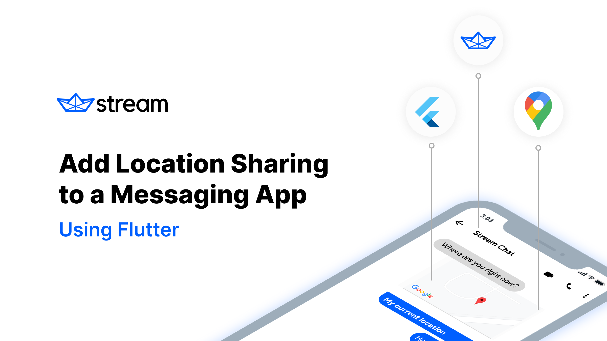

# Real time location sharing in chat using Flutter

This is a demo project to show how to add location sharing to a messaging app. The code is contained in the `lib` folder. 

The companion article to this reposioty can be found [here](https://getstream.io/blog/add-location-sharing-to-a-messaging-app-using-flutter/ ).

 

## Setup ⚙️
If you'd like to run this project locally, there are a few things you will need:
- Flutter SDK (v2.0.0): You can download the Flutter SDK from the [Flutter website](https://flutter.io/).
- Stream Chat API key: Developers can create a free account on [getstream.io](https://getstream.io/dashboard/signup) or sign up for Stream's Chat trial. 
- Google Maps API: You can get a Google Maps API key from [Google Developer Console](https://console.developers.google.com/). The project uses both the Maps API and the Maps JavaScript API (static image API).

 

## Running Locally 💻
Before cloning and attempting to run this project, please make sure you have the above prerequisites installed and configured on your system.

1. Clone this project and `cd` into the project directory.
2. Run `flutter packages get` install the various dependencies.
3. In `lib/main.dart` replace the `STREAM_KEY`, `MAP_KEY`, and `USER_TOKEN` with your own API key and [user token](https://getstream.io/chat/docs/react/token_generator/). 
3. Run `flutter run` to build and run the project.

> Note: This project was built and tested using the iOS simulator. If you are attempting to run this project on Android, please referece the [Google Maps](https://pub.dev/packages/google_maps_flutter) API documentation for platform specific instructions.

 

Happy Hacking! 
 
-- [Nash](https://twitter.com/Nash0x7E2)
